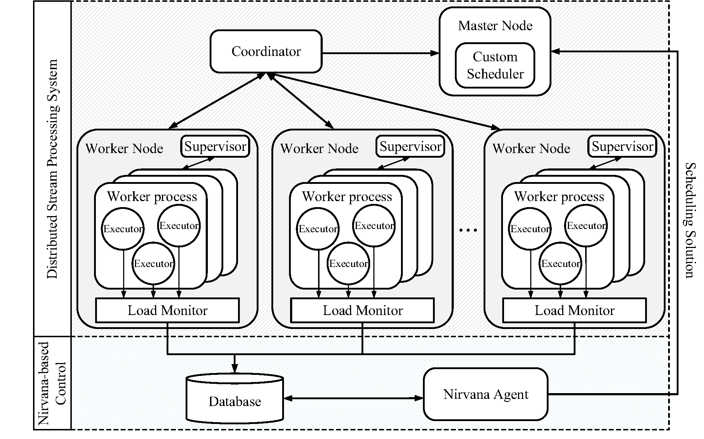

# Ares
Ares is a high performance and fault tolerant distributed stream processing system, which considers both system performance and fault tolerant capability during task allocation. 

## Introduction
In stream applications, a large volume of data is continuously generated and analyzed in real time style. To provide scalable processing infrastructures, different Distributed Stream Processing Systems (DSPSs) have been designed and widely deployed, such as S4, Storm, Heron, Flink, and Spark Streaming. A DSPS needs to process real time stream data with short latency. Meanwhile, it is commonly vital for a stream application to provide a long time continuous service without significant downtime. Upon a failure, a DSPS should recover as soon as possible. Therefore, it is important for a DSPS to achieve both short processing latency and short recovery time.
To achieve short processing latency, existing DSPS designs mainly leverage task allocation schemes that co-locate the pair of an upstream task and a downstream task in the topology in the same node, in order to avoid unnecessary inter-node communications. However, due to the dependency between upstream and downstream tasks, such an approach can cause cascaded waiting during the recovery of tasks. The problem becomes acute under correlated failures, where a number of nodes fail simultaneously because of the failure of switches, routers, and power facilities.
To address this issue, we design and implement the high performance and fault-tolerant distributed stream processing system, called Ares. 

## Structure of Ares



The architecture of Ares consists of the following components:

* **Nirvana agent** is the core component of Ares and is designed to solve the FTS problem. The Nirvana agent takes the resource statistics of worker nodes and the topology information of applications as inputs, applies a proposed best-response dynamics style algorithm (called Nirvana) to generate a  scheduling solution, and inputs it to the custom scheduler.
* **Custom scheduler** inputs the topology information of applications to the Nirvana agent, and deploys the scheduling solution generated by the Nirvana agent on worker nodes of the cluster via the master node.
* **Load monitor** collects the resource statistics of worker nodes at runtime for the Nirvana agent, and stores them to the database.
* **Database** stores the resource statistics of worker nodes including available resource of each executor and available resource of each worker node.


## How to use?

### Environment

We implement PStream atop Apache Storm (version 1.2.1 or higher), and deploy the system on a cluster. Each machine is equipped with an octa-core 2.4GHz Xeon CPU, 64.0GB RAM, and a 1000Mbps Ethernet interface card. One machine in the cluster serves as the master node to host the Storm Nimbus. The other machines run Storm supervisors.

### Initial Setting

Install Apache Storm (Please refer to http://storm.apache.org/ to learn more).

Install Apace Maven (Please refer to http://maven.apache.org/ to learn more).

Build and package the example

```txt
mvn clean package -Dmaven.test.skip=true
```

### Configurations

Configuration including the following

```txt
./ares-core/src/main/resources/componentcost.properties. (by default)
./ares-core/src/main/resources/componentToNodecost.properties. (by default)
./ares-core/src/main/resources/nodecomputecost.properties. (by default)
./ares-core/src/main/resources/nodetransferpair.properties. (by default)
```

### Using Ares

If you already deploy the Apache Storm cluster environment, you only need to replace these jars to `$STORM_HOME/lib` and `$STORM_HOME/lib-worker`
> * ares-core-1.0-SNAPSHOT.jar

#### ares-core.jar
ares-core module source code is maintained using [Maven](http://maven.apache.org/). Generate the excutable jar by running
```
cd ares-core
mvan clean install -Dmaven.test.skip=true -Dcheckstyle.skip=true
```

In the `storm.yaml` configuration of the nimbus node, perform the following configuration:

``` yaml
storm.scheduler: "com.basic.core.scheduler.GameScheduler"
```

### Ares Benchmark

#### Building Benchmark
Ares benchmark code is maintained using [Maven](http://maven.apache.org/). Generate the excutable jar by running
```
cd benchmark/xxx
mvan clean install -Dmaven.test.skip=true -Dcheckstyle.skip=true
```

#### Running Benchmark

After deploying a Ares cluster, you can launch Ares by submitting its jar to the cluster. Please refer to Storm documents for how to
[set up a Storm cluster](https://storm.apache.org/documentation/Setting-up-a-Storm-cluster.html) and [run topologies on a Storm cluster](https://storm.apache.org/documentation/Running-topologies-on-a-production-cluster.ht)

Then, you can submit the example to the Ares cluster

```txt
storm jar wordCount-1.0-SNAPSHOT.jar com.basic.benchmark.SentenceWordCountThroughputTopology StormWordcountTopollgy *PARALLISM*
```

## Publications

If you want to know more detailed information, please refer to this paper:

Changfu Lin, Jingjing Zhan, Hanhua Chen, Jie Tan, Hai Jin.  "[Ares: A High Performance and Fault-Tolerant Distributed Stream Processing System](https://ieeexplore.ieee.org/document/8526815/)" in Proceedings of 26th International Conference on Network Protocols (ICNP 2018), Cambridge, UK, September 25-27, 2018 ([Bibtex](AresStorm-conf.bib))

## Author and Copyright

Ares is developed in Big Data Technology and System Lab, Cluster and Grid Computing Lab, Services Computing Technology and System Lab, School of Computer Science and Technology, Huazhong University of Science and Technology, Wuhan 430074, China by Changfu Lin (lcf@hust.edu.cn), Jingjing Zhan (zjj@hust.edu.cn), Hanhua Chen (chen@hust.edu.cn), Jie Tan(tjmaster@hust.edu.cn), Hai Jin (hjin@hust.edu.cn)

Copyright (C) 2017, [STCS & CGCL](http://grid.hust.edu.cn/) and [Huazhong University of Science and Technology](http://www.hust.edu.cn).


